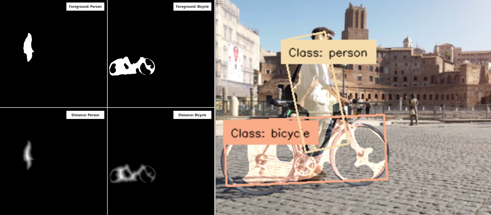

import ApiLink from '@site/src/components/ApiLink';

# Instance Segmentation

<div style={{ display: 'flex', gap: '2rem', alignItems: 'flex-start' }}>
  <div style={{ flex: '1' }}>

    The Instance Segmentation component is part of the Segments result class and is designed to identify turn segmentation results into instance segmentation results. It does this by taking the mask of each class and running a [Connected Component Analysis (CCA)](https://docs.opencv.org/3.4/d3/dc0/group__imgproc__shape.html#gaedef8c7340499ca391d459122e51bef5), to get the masks of separated objects. Then to deal with overlapping objects a [Watershed](https://docs.opencv.org/4.x/d3/db4/tutorial_py_watershed.html) algorithm is applied to improve the results of the instance segmentation. From these instance segmentation results you can calculate the bounding boxes or oriented bounding boxes, allowing you to connect Segments to many other modules like Tracker or Matcher. 

  </div>
  <div style={{ flex: '1' }}>
    
  </div>
</div>

Below an example of how one can use a Segments models to produce Instance Segmentation results in the Application Module Library.


```python title="instance_segment.py"
from modlib.apps import Annotator
from modlib.devices import AiCamera
from modlib.models.zoo import DeepLabV3Plus
from modlib.devices.frame import IMAGE_TYPE


class InstanceSegArgs:
    erosion_kernel: int = 3
    erosion_iteration: int = 2
    dilate_kernel: int = 5
    dilate_iteration: int = 5
    dist_threshold: float = 0.05
    size_threshold: int = 100
    config_mode = False


device = AiCamera()
model = DeepLabV3Plus()
device.deploy(model)

annotator = Annotator()

with device as stream:
    for frame in stream:
        detections = frame.detections
        if frame.image_type != IMAGE_TYPE.INPUT_TENSOR:
            detections.compensate_for_roi(frame.roi)
        instance_masks = detections.instance_segmentation(frame.width, frame.height, InstanceSegArgs)
        oriented_bboxes = detections.oriented_bbox()

        labels = [f"Class: {c}" for c, _, _, _ in detections]
        annotator.annotate_instance_segments(frame, detections)
        annotator.annotate_oriented_boxes(frame, detections, labels)
        frame.display()
```
Changing the `InstanceSegArgs` will allow you to fine-tune the algorithms for the situation. Enabling `config_mode` will allow you to visualize the effects of changing the different parameter values to see the difference the parameters make. 



Increasing the erosion and dilate kernel sizes or the iterations will change the masks so that they get smaller making it easier to calculate the different instances with the Watershed algorithm. The `dist_thrreshold` parameter will directly impact the distances matrix image you can see. Decreasing the threshold will allow objects that are closer together be more defined in the foreground. Then `size_threshold` sets the minimum mask size so that small masks don't get detected.