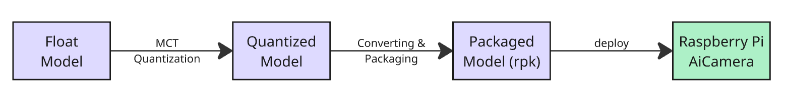
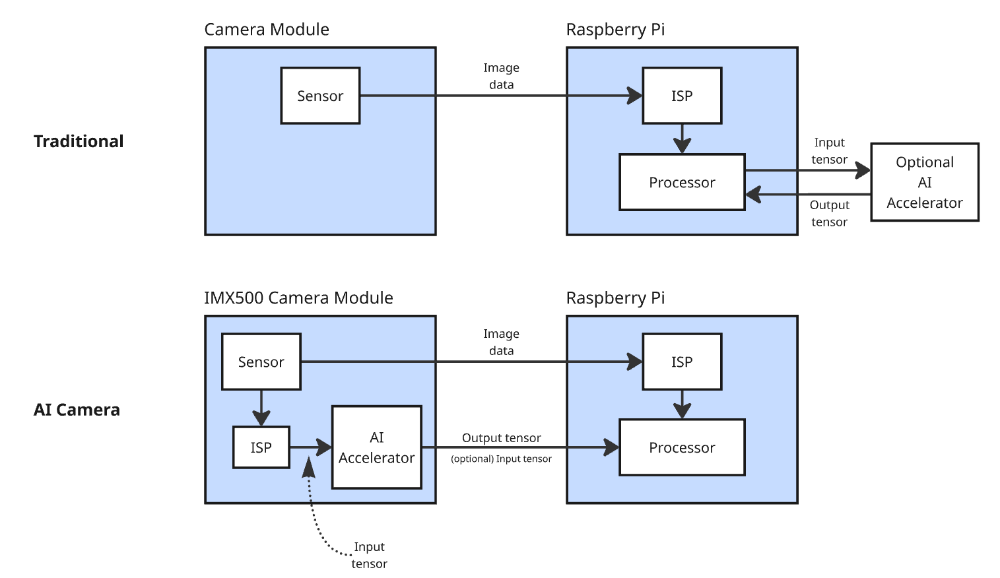
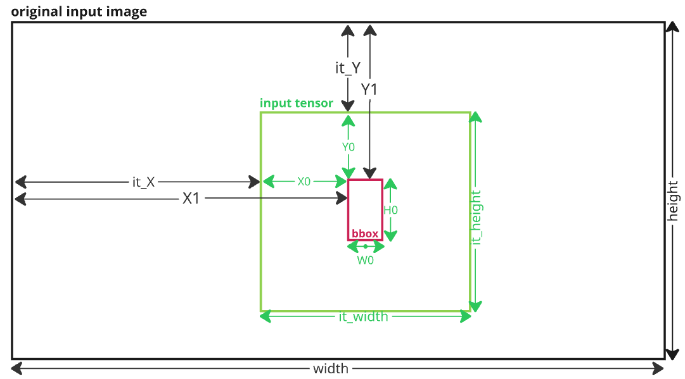
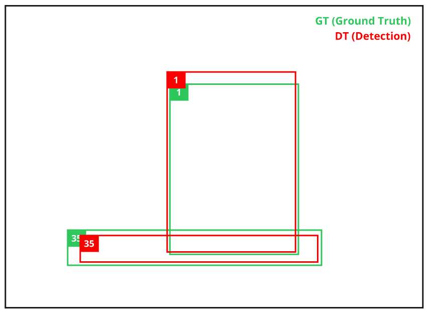
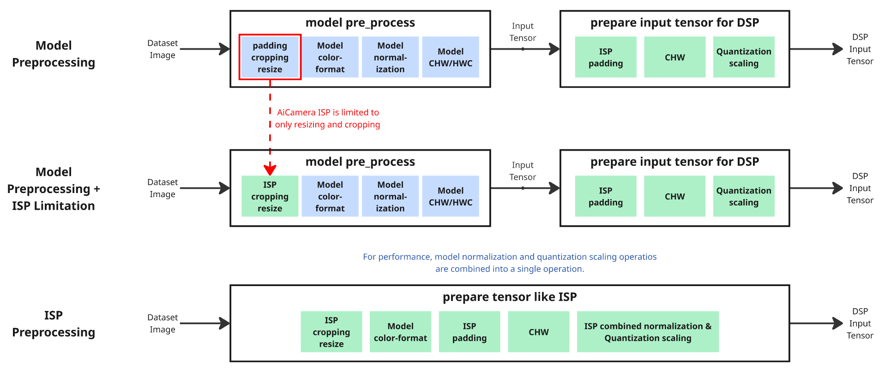
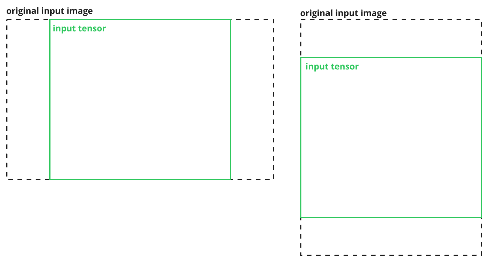

import Tabs from '@theme/Tabs';
import TabItem from '@theme/TabItem';
import ApiLink from '@site/src/components/ApiLink';


# Data Injection

Data Injection allows you to evaluate the performance of your AI models running on the Raspberry Pi AiCamera and is therefore a curcial step in the development of your computer vision application. The following page explains why Data Injection is so valuable, how to run it and how to apply it to your custom model. 

### Overview

A typical model development flow for the AiCamera would look something like this: 



- You have a floating-point model in your preferred framework (e.g., PyTorch) that is ready for deployment to the AiCamera. The framework typically provides baseline performance and accuracy metrics. The objective is to deploy this floating-point model to the AiCamera while maintaining performance metrics as close as possible to the original model. 
- The memory constraints of the AiCamera (8MiB available for both network and working memory) requires quantization of the floating-point model, compressing the model size. A starting point on how to use MCT for quantization can be found [here](https://github.com/SonySemiconductorSolutions/mct-model-optimization/tree/main/tutorials). Again, one should have an idea of model performance and accuracy metrics after the quantization step.
- Finally, the compressed model should be converted to the IMX500 AI accelerator format. Running the SDSP Converter & RPK Packager will make sure all different layers in your model are compatible with the architecture of the IMX500 and will package the model into a firmware file (`.rpk`) that can be loaded at runtime onto the camera. You can run these steps [manually](https://www.raspberrypi.com/documentation/accessories/ai-camera.html#model-deployment) or use [Modlib's custom models](./custom_models.md) to automatically convert, package & deploy the quantized model to the AiCamera.

:::note  
The goal of Data Injection is to evaluate the performance of the RPK model (quantized, converted & packaged) that is running on the AiCamera hardware. So you can compare the performance of the model running on the edge, with the performance of the quantized model and the floating-point model.  
:::

### Data Injection on the AiCamera

Unlike traditional camera module setups, where sensor image data is processed on the host device (or an optional external accelerator), the IMX500 camera module uses its internal ISP to preprocess sensor data into an input tensor that is ready for the IMX500 AI accelerator. The Raspberry Pi receives the model's output tensor from the AiCamera which, depending on the model, may already be post-processed. This architecture offloads all compute-intensive operations, making the Raspberry Pi's resources fully available for your application. 



Our goal during Data Injection is to prepare an input tensor from an image in our dataset, and inject it in the IMX500 AI accelerator so we can evaluate the performance of our Packaged RPK model. 


### First Data Injection Example

To prepare the Raspberry Pi for Data Injection, first disable the AiCamera cache. Update the `/boot/firmware/config.txt` file.

```
# (Adjust)
camera_auto_detect=0
...
# (Add) IMX500 camera, disable cache
dtoverlay=imx500,cam0,bypass-cache
```
And perform a reboot: `sudo reboot`.

Minimal examples to run data injection are available in the `examples/aicam/data_injection` folder of the [Modlib repository](https://github.com/SonySemiconductorSolutions/aitrios-rpi-application-module-library).
To get started make sure you retrieve all the sample images & assets by running.
```shell
uv run examples/get_assets.py
```

Now run a basic data injection example for every result type.
<Tabs>
  <TabItem value="classification" label="Classification" default>

```shell
uv run examples/aicam/data_injection/data_injection_minimal_cls.py
```
  </TabItem>
  <TabItem value="object-detection" label="Object Detection">

```shell
uv run examples/aicam/data_injection/data_injection_minimal_od.py
```

  </TabItem>
  <TabItem value="pose-estimation" label="Pose Estimation">

```shell
uv run examples/aicam/data_injection/data_injection_minimal_pose.py
```

  </TabItem>
  <TabItem value="segmenation" label="Segmentation">

```shell
uv run examples/aicam/data_injection/data_injection_minimal_seg.py
```

  </TabItem>
</Tabs>

Every data injection example follows a similar order of operations.
1. **Pre-process** the input image to an input tensor available for injection in the IMX500 DSP.
2. **Inject** the input tensor & post-process the output tensor according to model specification in one of <ApiLink to="/api-reference/models/results#result">the common result types</ApiLink>. This is automatically happens by the `device.inject` method and Modlib's definition of models and `Model.post_processor`'s. Just like running the `AiCamera` in normal operation.
3. **Visualize** the resulting detections with respect to the original input image (or the input tensor image, see [Visualizing Image vs. Input Tensor](#visualizing-image-vs-input-tensor) at the end).

**Region of Interest (ROI)**  
You may have noticed in the examples that a variable `roi` is obtained from preparing the input tensor and is passed to `Frame` object which used during visualization of the output detections. The Region of Interest (ROI) contains the information on how the coordinates of your resulting detections relate to your original image. We can explain using a general object detection bounding box. 

Let's say the pre-processing of your model requires to crop the original image to a certain ROI indicated by `it_X`, `it_Y`, `it_width`, `it_height`. After creating the input tensor (resizing, normalization ...), the model's output bounding boxes will as a result be defined in the coordinate system of the input tensor `(X0, Y0, W0, H0)`. So, when we visualize/evaluate the resuling model detections against the original input image, it is important to convert the detection coordinates to the coordinate system of the original image `(X1, Y1, W1, H1)`.



To cope with any resizing influences all these bounding box coordinates are (by design) internally always normalized to the width and height of its coordinate frame. `(x0, y0, w0, h0) = (X0/it_width, Y0/it_height, W0/it_width, Y0/it_height)`. Additionally, we define the ROI to contain how the input tensor coordinate frame relates to the coordinate frame of the original input image. `ROI = (it_X/width, it_Y/height, it_width/width, it_height/height)`. Defining and storing the ROI like this will simplify calculation later on.

So transforming the boxes to the coordinate frame of the original image would become:
`x1 = X1/width = (it_X + X0)/width = it_X/width + x0 * it_width/width = ROI[0] + x0 * ROI[2]`
The same holds true for the other coordinates:
```
x1 = ROI[0] + x0 * ROI[2]
y1 = ROI[1] + y0 * ROI[3]
w1 = ROI[0] + w0 * ROI[2]
h1 = ROI[1] + h0 * ROI[3]
```

Some extra remarks around ROI.
- While this example was using Object Detectionn bounding boxes. Similar reasoning applies for keypoints in pose estimation, and every pixel in a segmentation mask (NA in classification).
- While this example was using a cropped input tensor, the same reasoning holds true for any preprocessor that introduces padding of the input image. In this case the ROI `(it_X/width, it_Y/height, it_width/width, it_height/height)` may have values `ROI[0]`,`ROI[1]` `< 0`, and `ROI[2]`, `ROI[3]` may be `> 1`. 
- Any preprocessor that uses resizing without preserving the aspect ratio, has no extra effect on the normalized ROI. This is automatically adjusted for, when scaling the normalized coordinates to the dimentions of the original frame.


### Evaluation

Now we know how to inject an image into the IMX500, and correctly scale the output detections. The next step is to evaluate the result against a **ground truth** and produce some performance/accuracy metrics for our model. We'll be using the sample images we downloaded earlier, as an example minimal dataset. However you can use any dataset that you prefer.

Every AI task has its own dedicated Evaluator object that helps producing the metrics.
| AI Task             | Detection Result Type                                  | Evaluator              | Metrics   |
|---------------------|--------------------------------------------------------|----------------------|----------------------|
| Classification      | <ApiLink to="/api-reference/models/results#classifications">Classifications</ApiLink> | <ApiLink to="/api-reference/models/evals#classificationevaluator">ClassificationEvaluator</ApiLink> | `top1_accuracy`, `top5_accuracy`, `confusion_matrix`, `per_class_accuracy`|
| Object Detection    | <ApiLink to="/api-reference/models/results#detections">Detections</ApiLink> | <ApiLink to="/api-reference/models/evals#cocoevaluator">COCOEvaluator</ApiLink> | COCO's `Average Precision (AP)` and `Average Recall (AR)` |
| Pose Estimation     | <ApiLink to="/api-reference/models/results#poses">Poses</ApiLink> | <ApiLink to="/api-reference/models/evals#cocoposeevaluator">COCOPoseEvaluator</ApiLink> | COCO's `Average Precision (AP)` and `Average Recall (AR)` |
| Segmentation        | <ApiLink to="/api-reference/models/results#segments">Segments</ApiLink> | <ApiLink to="/api-reference/models/evals#vocsegevaluator">VocSegEvaluator</ApiLink> | `per_class_iou`, `mean_iou`, `per_class_accuracy`, `mean_accuracy`, `pixel_accuracy`, `fw_iou` |


Every evaluation example follows a similar flow:
- Define your dataset and Evaluator ground truth
- Get the detection by Data Injection and store in the samples (`list[EvaluationSample]`)
- Use the evaluator to run evaluation on ground truth vs the detections.

Run the example data injection with evaluation like this:

<Tabs>
  <TabItem value="classification" label="Classification" default>

```shell
uv run examples/aicam/data_injection/evaluator_minimal_cls.py
```

Example output:
```
================================================================================
Classification Evaluation Results
================================================================================
Total samples: 3
Top-1 Accuracy: 1.0000 (3/3)
Top-5 Accuracy: 1.0000 (3/3)

Per-class accuracy (3 classes with samples):
  goldfish, Carassius auratus: 1.0000 (1/1)
  iPod: 1.0000 (1/1)
  daisy: 1.0000 (1/1)

Confusion Matrix (rows=ground truth, cols=predicted):
GT\Pred     1   605   985
  1 (goldfish, Caras)     1     0     0
605 (iPod           )     0     1     0
985 (daisy          )     0     0     1
================================================================================
```

  </TabItem>
  <TabItem value="object-detection" label="Object Detection">

```shell
uv run examples/aicam/data_injection/evaluator_minimal_od.py
```

Example output:
```
 Average Precision  (AP) @[ IoU=0.50:0.95 | area=   all | maxDets=100 ] = 0.490
 Average Precision  (AP) @[ IoU=0.50      | area=   all | maxDets=100 ] = 0.739
 Average Precision  (AP) @[ IoU=0.75      | area=   all | maxDets=100 ] = 0.567
 Average Precision  (AP) @[ IoU=0.50:0.95 | area= small | maxDets=100 ] = 0.083
 Average Precision  (AP) @[ IoU=0.50:0.95 | area=medium | maxDets=100 ] = 0.758
 Average Precision  (AP) @[ IoU=0.50:0.95 | area= large | maxDets=100 ] = 0.975
 Average Recall     (AR) @[ IoU=0.50:0.95 | area=   all | maxDets=  1 ] = 0.454
 Average Recall     (AR) @[ IoU=0.50:0.95 | area=   all | maxDets= 10 ] = 0.503
 Average Recall     (AR) @[ IoU=0.50:0.95 | area=   all | maxDets=100 ] = 0.513
 Average Recall     (AR) @[ IoU=0.50:0.95 | area= small | maxDets=100 ] = 0.135
 Average Recall     (AR) @[ IoU=0.50:0.95 | area=medium | maxDets=100 ] = 0.767
 Average Recall     (AR) @[ IoU=0.50:0.95 | area= large | maxDets=100 ] = 0.975
```

  </TabItem>
  <TabItem value="pose-estimation" label="Pose Estimation">

```shell
uv run examples/aicam/data_injection/evaluator_minimal_pose.py
```

Example output:
```
 Average Precision  (AP) @[ IoU=0.50:0.95 | area=   all | maxDets= 20 ] = 0.158
 Average Precision  (AP) @[ IoU=0.50      | area=   all | maxDets= 20 ] = 0.366
 Average Precision  (AP) @[ IoU=0.75      | area=   all | maxDets= 20 ] = 0.188
 Average Precision  (AP) @[ IoU=0.50:0.95 | area=medium | maxDets= 20 ] = 0.101
 Average Precision  (AP) @[ IoU=0.50:0.95 | area= large | maxDets= 20 ] = 0.225
 Average Recall     (AR) @[ IoU=0.50:0.95 | area=   all | maxDets= 20 ] = 0.155
 Average Recall     (AR) @[ IoU=0.50      | area=   all | maxDets= 20 ] = 0.364
 Average Recall     (AR) @[ IoU=0.75      | area=   all | maxDets= 20 ] = 0.182
 Average Recall     (AR) @[ IoU=0.50:0.95 | area=medium | maxDets= 20 ] = 0.100
 Average Recall     (AR) @[ IoU=0.50:0.95 | area= large | maxDets= 20 ] = 0.220
```

  </TabItem>
  <TabItem value="segmenation" label="Segmentation">

```shell
uv run examples/aicam/data_injection/evaluator_minimal_seg.py
```

Example output:
```
====================================================================================================
mIoU: 0.8245
Pixel Accuracy: 0.9581
Mean Accuracy: 0.9185
Frequency Weighted IoU: 0.9222
====================================================================================================
```

  </TabItem>
</Tabs>


**Visualization**

<div style={{ display: 'flex', gap: '2rem', alignItems: 'flex-start' }}>
  <div style={{ flex: '1' }}>
    
    Every evaluator also has the ability to visualize the obtained detections against the ground truth (cfr. `evaluator.visualize(samples, output_dir, ...)`). This allows you to visualy inspect the performance and failure points of your model. Please note that confidence thresholds are required when applicable. (E.g. When a bounding box does not show in visualization, the box might still be detected but at a lower confidence than the provided `detection_threshold`)

  </div>
  <div style={{ flex: '1' }}>
    
  </div>
</div>


### Compare against quantized model performance

While out of scope for this document, it is possible to now compare these performance metrics against the quantized model. One can use Modlib's [InterpreterClient](devices/interpreters.md) device and run the same evaluation methods on the same dataset.

Note that running the enterpreter requires an Inference Server to be running simultaneously, For an example implenation of such a Interpreter Server, please have a look at the the example folder in Modlib: https://github.com/SonySemiconductorSolutions/aitrios-rpi-application-module-library/tree/main/examples/interpreters

For a full guide on how to setup the interpreter please read the [Interpreter device documentation](devices/interpreters.md)

Basic examples on how to run evaluation with the Interpreter device are also provided:
<Tabs>
  <TabItem value="classification" label="Classification" default>

```shell
uv run examples/interpreters/evaluator_minimal_cls.py
```
  </TabItem>
  <TabItem value="object-detection" label="Object Detection">

```shell
uv run examples/interpreters/evaluator_minimal_od.py
```

  </TabItem>
  <TabItem value="pose-estimation" label="Pose Estimation">

```shell
uv run examples/interpreters/evaluator_minimal_pose.py
```

  </TabItem>
  <TabItem value="segmenation" label="Segmentation">

WIP

  </TabItem>
</Tabs>


### Understanding pre-processing and ISP limitations

So far we have consistently used this method `isp.prepare_tensor_like_isp(...)` to prepare our image as DSP input tensors and use it for data injection. The function mimics the functionality of the ISP on board of the Ai Camera module. (See the image above that illustrates Data Injetion on the AiCamera). However, there are multiple different ways converting the sample image to an input tensor that will impact the resulting performance. It is important to understand the different methods, and choose the one that matches your expectations.




1. **Model Preprocessing**
> Best possible accuracy with data injection.

One could choose to follow the pre-processing methods specified by the float/quantized model (available in `model.pre_process`). Since the original AI model was trained, validated and tested with this pre-processor, it is expected that this will result in the best possible performance when running data injection. The typical preprocessing looks like this:

*Model preprocessing*
  - Padding, cropping and resizing to the input tensor size. Following your model specification and wether or not to preserve the original aspect ratio of the sample image.
  - Convert the image color format to the RGB/BGR color format of your model.
  - Apply model normalization (`x_norm = mean * x + std` using `mean` and `std` values defined by your model)
  - Convert to the channel order to the order defined the framework format of your model. Typically `HWC` for Tensorflow, and `CHW` for PyTorch models.

NOTE: After applying model preprocessing one has the intermediate **intput tensor** which can be used for running inferencing the `InterpreterClient` for comparison with the quantized model.  
Some extra steps are required to prepare this input tensor for the IMX500 DSP.

*Pepare input tensor for DSP*
- ISP padding: The IMX500 expects a dedicated memory block for the input tensor. The input tensor might be padded with extra 0's depending on the model input tensor width and height.
- CHW: IMX500 firmware always requires a CHW channel order.
- Quantization scaling: `x_quant = scale * x_norm + shift`. A converted model expects the input tensor range (`int8` or `uint8`) to be the quantized input tensor. Compared to the quantized model which still expect normalized float values and does the quantization scaling in the first layers of the model.

After applying both steps, one gets a resulting DSP Input Tensor that the IMX500 will accept for injection.

Example:
```
it_image, it, roi = model.pre_process(
    image=sample.image,
    src_color_format=sample.image_color_format,
)

dsp_input_tensor = isp.prepare_input_tensor_for_dsp(it, model)
```

2. **Model Preprocessing + ISP limitation**
> Result that matches ISP behaviour and can still be compared with the result of the quantized model.

The ISP module on the AiCamera has a critical limitation. While it allows for resizing and cropping, it does not provide any functionality for padding the sensor image. This means that it is impossible to follow a model preprocessor that requires to pad the input image (e.g. like YOLO).


<div style={{ display: 'flex', gap: '2rem', alignItems: 'flex-start' }}>
  <div style={{ flex: '1' }}>
    
    To integrate this limitation, one can swap out the resize function of the model pre-processor with the default behaviour of the ISP and AiCamera device in Modlib. The `isp_resize_and_crop` function does not include extra padding for specific models that require to preserve the aspect ratio. Instead the effect depends if the model requires `preserve_aspect_ratio`.

    - `preserve_aspect_ratio=True`
      - Center-crop the image (no padding) to match the aspect ratio of the model's input tensor size. Cropping preserves spatial relationships but may result in some edges being lost. (See illustrated image). To mitigate the effect on the data injection result, choose dataset images where the aspect ratio is close to the aspect ratio of the model input tensor. Alternatively, match the AiCamera sensor aspact ratio of `1.3342`.
      - Resize to the model input tensor size.
    - `preserve_aspect_ratio=False`
      - Resize the entire image to the input tensor size directly, ignoring the original aspect ratio.

  </div>
  <div style={{ flex: '1' }}>
    
  </div>
</div>

Example:
```
from functools import partial

it_image, it, roi = model.pre_process(
    image=sample.image,
    src_color_format=sample.image_color_format,
    resize_fn=partial(isp.isp_resize_and_crop, model=model)
)

dsp_input_tensor = isp.prepare_input_tensor_for_dsp(it, model)
```

3. **ISP Preprocessing**
> Result that best matches the actual ISP behaviour. However, no interemdiate input tensor available for framework inference.

In practice, the AiCamera ISP module does not perform seperate operations. Model normalization and Quantization scaling are combined into a singel operation to avoid the need for allocating memory of the intermediate input tensor.

In short: 
```
x_norm = (x - mean) / std     # 1. Normalization: 
q = x_norm * scale + shift    # 2. Quantization/scale: 
```
These normalization and quantization scale operations can be expanded to:
```
q = A * x + B                 where A = scale / STD, B = -scale * MEAN / STD + shift
```
Please read the comments in the `isp_normalize_and_quantscale`-function on how this is done in practice.  

NOTE: That now there is no input tensor available which can be used for comparison with the quantized framework model. The data injection results when choosing this pre-processing method can only be compared against the ground truth.

Example:
```
dsp_input_tensor, roi = isp.prepare_tensor_like_isp(
    img=sample.image,
    model=model,
    src_color_format=sample.image_color_format,
)
```


### Visualizing Image vs. Input Tensor

So far we have always been visualizing the data injection results on the original dataset image. One can easily visualize and map the detection on the original coordinate system (=ROI compensations) using Modlib's `Frame` and `annotation` functions.

To visualize the result on the original sample image:
```
h, w, c = sample.image.shape
frame = Frame(
    timestamp=datetime.now(),
    image=sample.image,                      # from dataset
    image_type=IMAGE_TYPE.SOURCE,            # Datset is SOURCE
    color_format=sample.image_color_format,  # from dataset
    width=w, height=h, channels=c,
    detections=detections,                   # from inject
    roi=roi,                                 # from pre-processing
    new_detection=True, fps=0, dps=0,
    frame_count=0,
)
```

Alternatively, it is also possible to visualize the result on the actual injected input tensor image. This can be usefull to visualy inspect what is exactly being injected into the IMX500.

```
h, w, c = it_image.shape
frame = Frame(
    timestamp=datetime.now(),
    image=it_image,                             # from pre-processing
    image_type=IMAGE_TYPE.INPUT_TENSOR,         # INPUT_TENSOR
    color_format=model.color_format,            # from model
    width=w, height=h, channels=c,
    detections=detections,                      # from inject
    roi=ROI(left=0, top=0, width=1, height=1),  # exactly the input tensor
    new_detection=True, fps=0, dps=0,
    frame_count=0,
)
```

Only in case of pre-processing like ISP, there is no intermediate input tensor. It is still possible to deduce an input tensor image from the dsp_input_tensor by applying ISP denormalization to get input tensor image: 
```
it_image = isp.isp_denormalize_input_tensor(dsp_input_tensor, model)
```


### Known Data Injection limitations and rough edges

- Data Injection is sensitive to the `frame_rate` setting during initialization of the `AiCamera` device. Minimum injection with frame_rate=5. Any frame rate lower then 5 might produce:
```
ERROR:ai_camera:Error setting tensor: IMX500: Unable to set input tensor fd: [Errno 11] Resource temporarily unavailable
```
- Increasing number of retries for high frames and large datasets. When injection fails it will automatically retry to inject the `dsp_input_tensor` into the IMX500. After a couple of injections, or when using high `frame_rate` settings, more and more retries tend to happen.
```
ERROR:ai_camera:Error setting tensor: IMX500: Unable to set input tensor fd: [Errno 121] Remote I/O error
WARNING:ai_camera:Retrying... (100 retries left)
INFO:ai_camera:Injection comparison frame: 28
INFO:ai_camera:frame.frame_count: 2, cmp_frm: 28, diff: 230
INFO:ai_camera:frame.frame_count: 2, cmp_frm: 28, diff: 230
INFO:ai_camera:frame.frame_count: 2, cmp_frm: 28, diff: 230
INFO:ai_camera:frame.frame_count: 28, cmp_frm: 28, diff: 0    # success
```
- With performing data injection with YOLO models, always 1 retry seems to be required no matter which `frame_rate`.