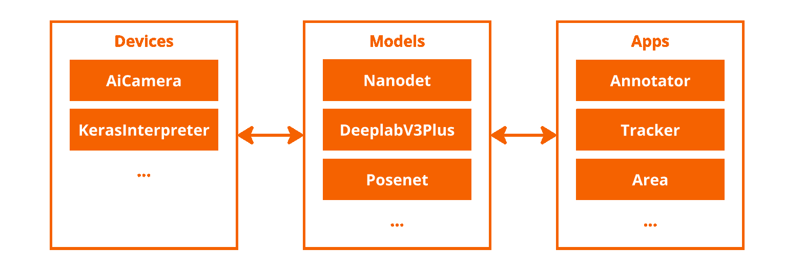

# Why modlib?

## Purpose

The Application Module Library (modlib) is an SDK designed for creating **end-to-end IMX500 application​**. It aims to meet the expectations of **a large and diverse group of users, each with different objectives and expectations**. The library provides abstractions for specific parts of the development process, allowing users to **focus** on their particular areas of interest. The intuitive Python interface enables developers to streamline their workflow and concentrate on the aspects most relevant to their projects.

> It aims to provide this by being:  
>  
> 💎 **All in one**: Provides integration with all AITRIOS tools (Converter, Packager, Brain Builder, etc.) into one environment.  
> 📦 **Scalable**: The modular design of the library allows easy to add new IMX500 devices, new AI models and Apps.  
> ⏱️ **Intuitive & Fast & Compact**: Reduce development time by providing templates for Python users to create E2E solution.​ In only a couple of minutes!​

## Modularity

The Application Module Library consists of 3 core components that are fully **INDEPENDENT** and agnostic of ​
each other existence:​

- Devices: Any IMX500 powered device can be onboarded and used with for application development.
​
- Models: Pytorch and Keras models can be **converted, packaged & deployed** to any device. ​
Choose a **post-processor** function provided or develop your own post-processing function by converting the output tensor to a **predefined detection format**. ​
​
- Apps: After choosing what model on which device. Enjoy a set of prebuilt, modular application components that supports the developer in solving his use-case. (e.g. annotators, tracker, heatmap … )

## Tooling

Thanks to its device abstraction layer, the Application Module Library can serve as a foundation for low-code UI/UX tools. This feature ensures that tools built on modlib are not restricted to specific devices, but are compatible with any device supported by the library.

Moreover, these tools can immediately leverage new functionalities as they are added to the Application Module Library, ensuring they remain cutting-edge without the need for extensive frontend redevelopment. Simulatneously, the Application Module Library keeps supporting developers in creating end-to-end solutions with its straightforward Python API, making it accessible for a wide range of use cases.

The modular architecture of modlib also acts as a safeguard against future changes. Products that integrate the Application Module Library at their core are inherently protected from changes in devices, models, or applications to other already existing features.
